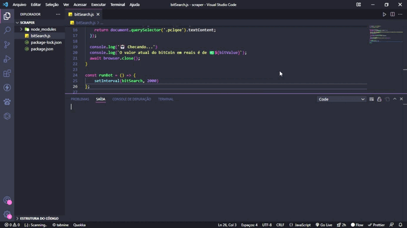

# BitBot v.1 🤖📈💲

 
 
 
 
### 🎛️ Dependencias
 
- [Puppeteer](https://pptr.dev/) - Scrapper

 
### 🎯 Objetivo
Monitorar o valor da moeda para ajudar possíveis Daytraders no dia a dia.

### 🔎 Como utilizar

- Clonar o rep.
- Executar o comando abaixo.
- `npm install`
- Executar o arquivo `bitSearch.js` com `node bitSearch.js`

### 🎨 Autor

[LinkedIn](https://www.linkedin.com/in/mateusmarcelino/) 
